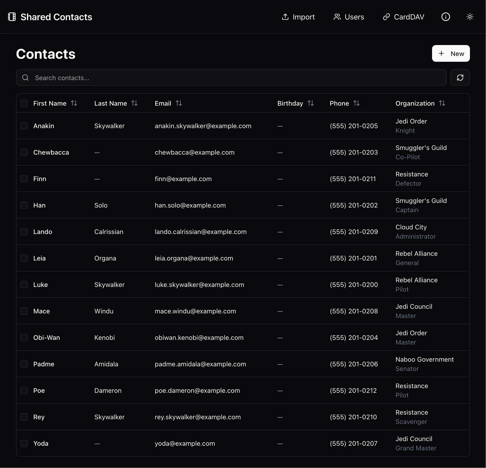
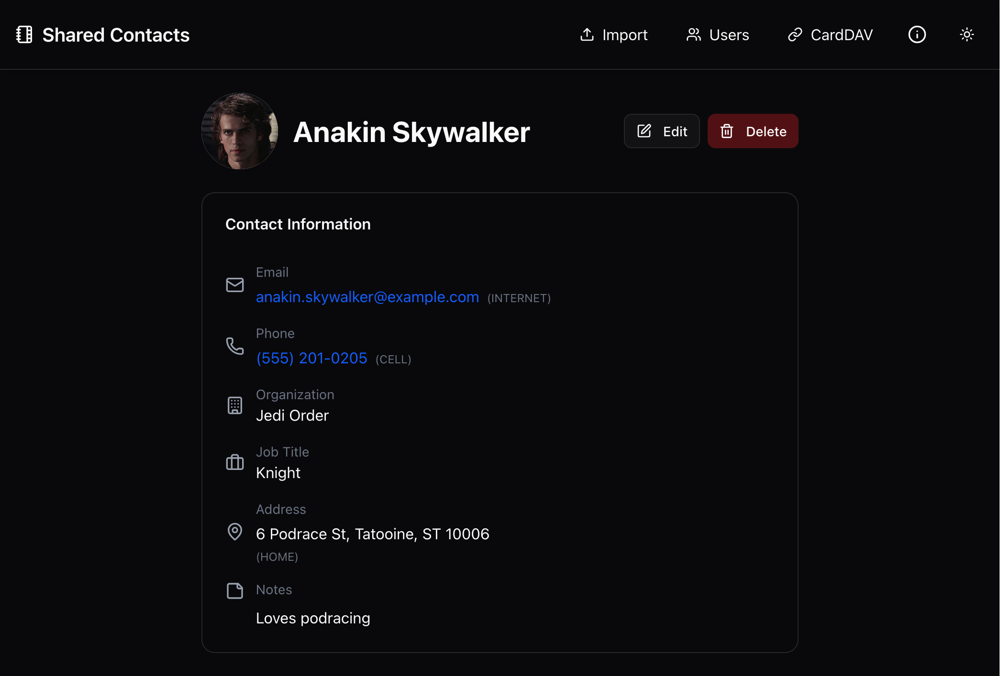
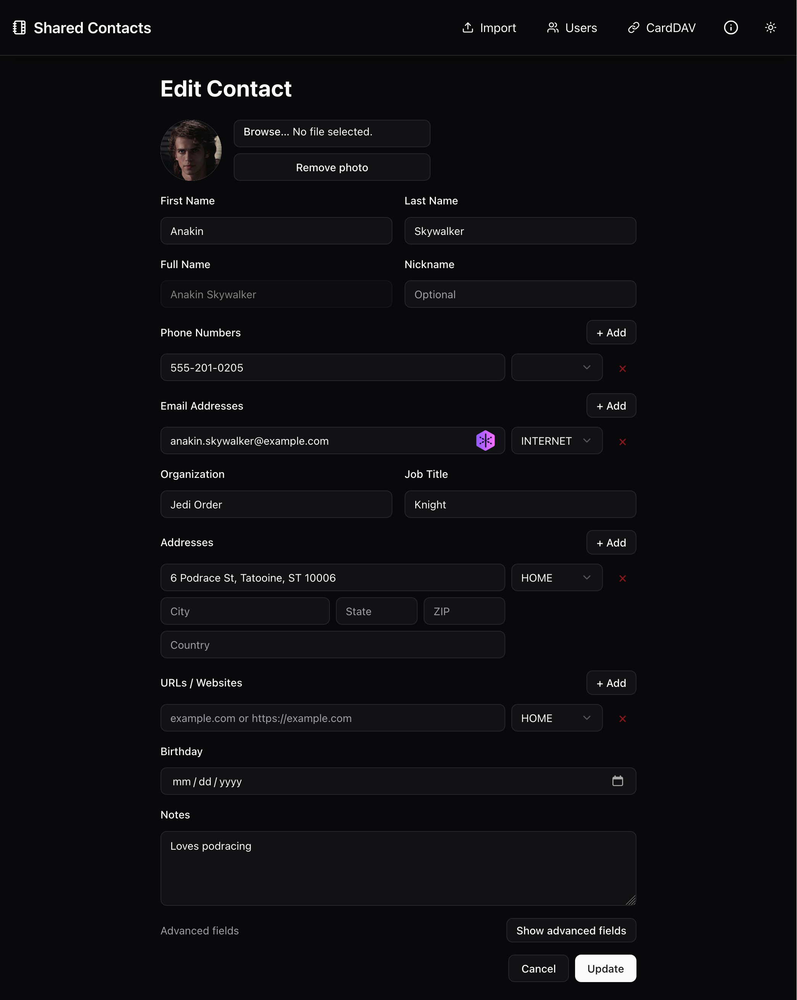
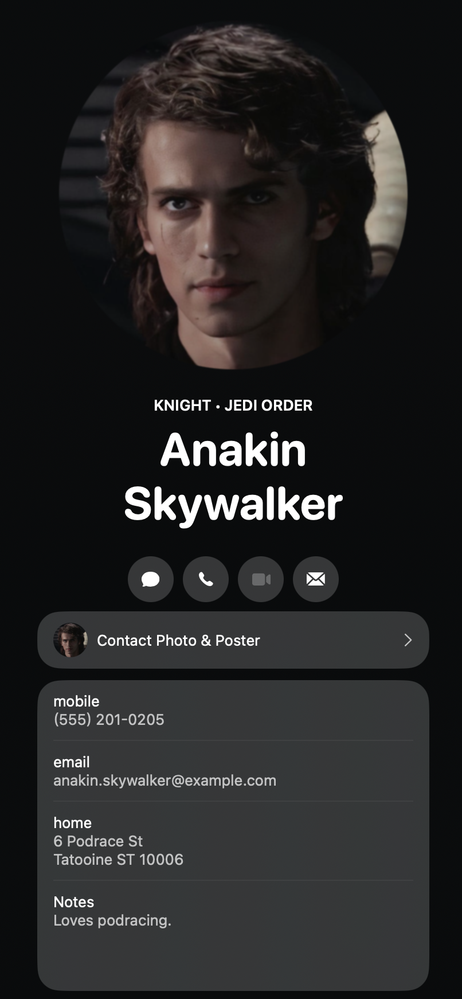

# Shared Contacts - CardDAV Server

[](https://www.gnu.org/licenses/agpl-3.0)

> [!WARNING]
> This project is not production ready but is slowly becoming more stable. I stood this project up as an experiment with Cursor and I'm now trying to harden it. Do NOT use this without proper backups or with mission-critical data. Currently, there is NO AUTHENTICATION so do not expose this publicly.

> [!NOTE]
> To avoid exposing anything, one might run this locally and access it through a VPN (e.g. Tailscale).

A self-hostable CardDAV server for managing shared contacts with a modern web-based management interface.

## Why?

I've been waiting for Apple to create a shared address book feature for iCloud for ages and I finally decided to make a personal one for myself. I rely on my contacts for the usual things but also birthdays and notes. I didn't want a full-blown CRM but something more lightweight.

I also have a large extended family that I'd love to stay in touch with as much as possible. This allows me to simply create users (per person or basic read/rw users) and share the CardDAV URL. Now, we can update any details we need to, when we need to.

## Features

- **CardDAV Server**: Full CardDAV protocol support via Radicale
- **Web Management UI**: Modern React-based interface built with TanStack Start
- **PostgreSQL Backend**: Queryable database for fast contact searches
- **Bidirectional Sync**: Automatic synchronization between CardDAV and database
- **User Management**: Manage Radicale users for CardDAV access
- **Docker Compose**: Easy deployment with Docker

## Screenshots






## AI Contribution Disclosure


> [!IMPORTANT]
> This project uses [Level 5 AI assistance](https://www.visidata.org/blog/2026/ai/) — AI generated the majority of the code, but the human was involved at every step, reviewing each line with full attention. The human understands every algorithm and has logically validated how it all works.
>
> **AI Model:** Claude Opus 4

## Backup and Restore

### Backup Database

```bash
docker-compose exec postgres pg_dump -U sharedcontacts sharedcontacts > backup.sql
```

### Restore Database

```bash
docker-compose exec -T postgres psql -U sharedcontacts sharedcontacts < backup.sql
```

### Backup Radicale Data

```bash
docker-compose exec radicale tar czf /tmp/radicale-backup.tar.gz /data
docker cp shared-contacts-radicale:/tmp/radicale-backup.tar.gz ./radicale-backup.tar.gz
```

## Security Notes

1. **Change default passwords** in production
2. **Use HTTPS** in production (configure reverse proxy)
3. **Restrict network access** to services
4. **Regular backups** of database and Radicale data
5. **Keep Docker images updated**

## Mobileconfig profiles and signing

You can generate `.mobileconfig` profiles from the CardDAV Connection page to simplify setting up iOS and macOS clients. Two download options are available per user:

- **Download profile** (per book): installs a single CardDAV account. Appears as its own entry in _Settings → General → VPN & Device Management_.
- **Download combined profile** (per user): bundles every address book the user can access into a single profile that installs as **one entry** in Settings. Each book still shows as its own section in the Contacts app (an Apple CardDAV limitation).

All profiles share the organization / brand string configured on the CardDAV Connection page (falls back to the `MOBILECONFIG_ORG` env var, then to `"Shared Contacts"`). Payload identifiers and UUIDs are deterministic per `(user, book)` so reinstalling replaces the existing profile rather than creating duplicates.

Profiles are unsigned by default. In production you may want them signed so devices show a trusted issuer and tampering is harder. Signing is controlled by environment variables:

- `MOBILECONFIG_SIGNING_ENABLED=true|false`: turns signing on or off (defaults to `false`)
- `MOBILECONFIG_SIGNING_CERT_PATH`: path to a PEM-encoded signing certificate
- `MOBILECONFIG_SIGNING_KEY_PATH`: path to the corresponding private key (PEM)
- `MOBILECONFIG_SIGNING_CHAIN_PATH` (optional): path to intermediate certificates for the chain
- `MOBILECONFIG_SIGNING_KEY_PASSPHRASE` (optional): passphrase for the private key

When enabled, the server builds the XML payload, then signs it with `openssl smime -sign -outform DER` as a subprocess and returns the DER-encoded CMS envelope. If signing is enabled but the cert or key is missing/unreadable, the server logs a warning and falls back to returning the unsigned XML rather than erroring out, so generation is never blocked by misconfiguration.

Self-signed certificates work but iOS will label the profile as "Unverified". For a "Verified" badge, use a publicly-trusted code signing or client certificate chain. Provide certs and keys via Docker secrets or mounted volumes, **never baked into the image**.

## License

GNU AGPLv3

## Contributing

Contributions welcome! Please open an issue or submit a pull request.
